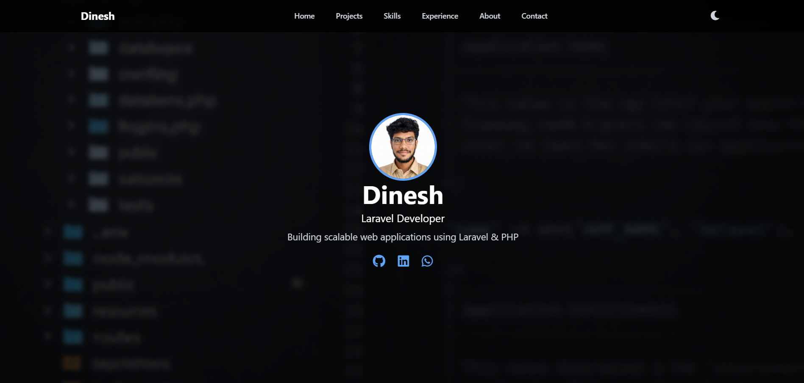
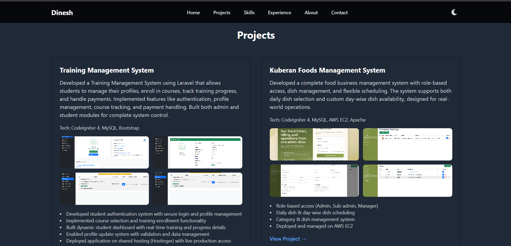
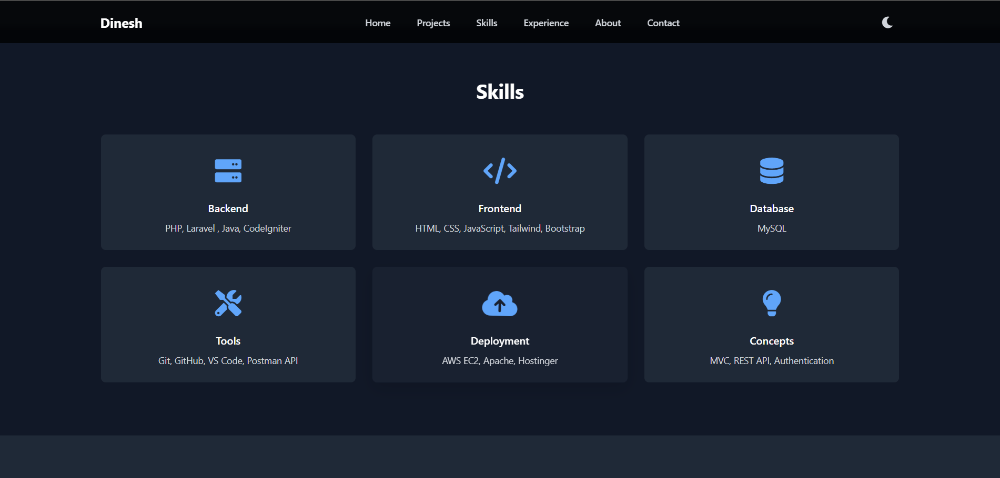

# 💼 Dinesh Moorthi - Portfolio

Welcome to my personal portfolio website showcasing my skills, projects, and experience as a Laravel Developer.

## 🚀 About Me

I am a Laravel Developer with experience in building scalable web applications, admin panels, and REST APIs.  
I have worked on real-time projects and deployed applications using AWS EC2 and shared hosting platforms.

I started my career in technical field roles, which helped me develop strong problem-solving skills and practical thinking.

---

## Screenshots

## 🛠️ Tech Stack

- PHP
- Laravel
- MySQL
- JavaScript
- HTML, CSS, Tailwind CSS
- AWS EC2
- Apache
- Git & GitHub

---

## 📂 Projects

### 🔹 Training Management System
- Student login & dashboard
- Course selection and training tracking
- Profile management system
- Hosted on Hostinger

### 🔹 Kuberan Foods Management System
- Role-based access (Admin, Manager)
- Daily & day-wise dish scheduling
- Category & dish management
- Hosted on AWS EC2

### 🔹 Hikoo Tech System (Ongoing)
- Admin panel & student system
- Course and user management
- Authentication & role-based access

---

## 🌐 Live Demo

👉 [View Portfolio] https://dineshmoorty.github.io/Portfolio/

---

## 📫 Contact

- 📧 Email: dineshmoorthias@gmail.com
- 💼 LinkedIn: www.linkedin.com/in/dineshmoorthi-as
- 💻 GitHub: https://github.com/dineshmoorty/

---

## ⚡ Deployment

This portfolio is deployed using **GitHub Pages**.

---

## ⭐ Support

If you like this project, feel free to give it a ⭐ on GitHub!